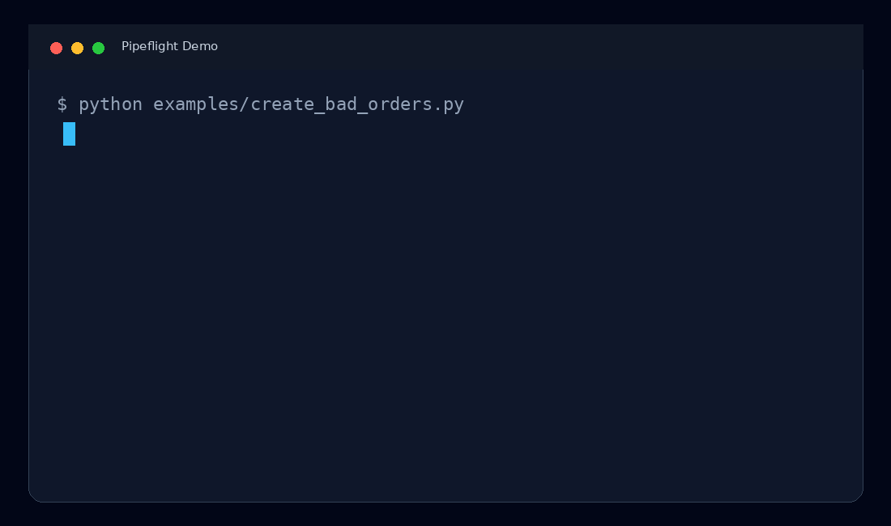
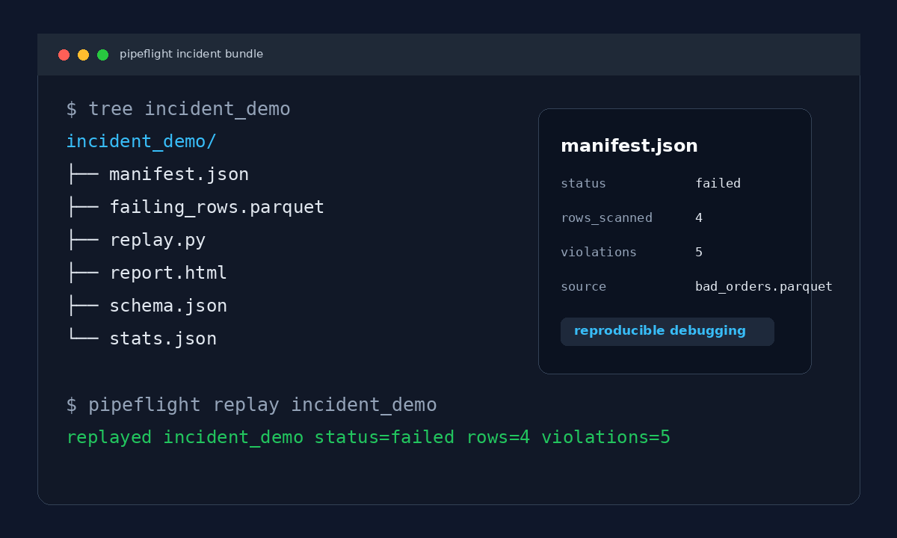

# Pipeflight

[](https://github.com/lakshmisay/pipeflight/actions/workflows/ci.yml)
[](https://pypi.org/project/pipeflight/)
[](https://pypi.org/project/pipeflight/)
[](LICENSE)

**A black box recorder for data pipelines.**

Most data quality tools tell you that something failed. Pipeflight preserves the evidence you need to debug it later: failing rows, schema snapshot, stats, report, and a replay script.

```bash
pipeflight record orders.parquet --key order_id --contract orders.contract.json
```

Pipeflight creates a small incident folder:

```text
incident_2026_05_18_112233/
  manifest.json
  failing_rows.parquet
  schema.json
  stats.json
  replay.py
  report.html
```

You can attach that folder to a ticket, send it to another engineer, or replay it locally without sharing the full source dataset.

## Demo



Pipeflight turns a failing dataset into a portable incident bundle:



## Why Incident Replay Matters

When a production data pipeline fails, the original dataset can be huge, sensitive, temporary, or already overwritten. The team may know that validation failed, but not have the exact rows, schema, or stats needed to reproduce the incident.

Pipeflight records a compact evidence bundle at failure time so debugging is reproducible.

It helps answer:

- Which exact rows failed validation?
- Which rule failed?
- What did the schema look like?
- How many rows were scanned?
- Was the timestamp data stale?
- Can another engineer replay the incident locally?

## How It Works

```text
Dataset + optional contract
       |
       v
pipeflight record orders.parquet --key order_id --contract orders.contract.json
       |
       v
Incident bundle
  |-- manifest.json
  |-- failing_rows.parquet
  |-- schema.json
  |-- stats.json
  |-- replay.py
  `-- report.html
       |
       v
pipeflight replay incident_2026_05_18_112233
       |
       v
Reproducible debugging
```

## Input And Output

### Input

Pipeflight accepts:

- CSV files: `.csv`
- JSON Lines files: `.jsonl` or `.ndjson`
- Parquet files: `.parquet`
- optional contract files: JSON, or YAML when installed with `pipeflight[yaml]`
- optional key column: used to detect missing identifiers

Example:

```bash
pipeflight record examples/validation_matrix.csv --key order_id --contract examples/validation_matrix.contract.json --out incident_validation_matrix
```

### Output

Pipeflight writes an incident directory containing:

- `manifest.json`: run metadata, status, source path, row count, violation count
- `failing_rows.parquet`: only the rows that failed validation
- `schema.json`: inferred column types
- `stats.json`: row count, null counts, min/max values, max datetimes
- `report.html`: human-readable incident report
- `replay.py`: tiny script for replaying the incident folder

Example output:

```text
recorded incident_validation_matrix status=failed rows=13 violations=16
```

## Why Pipeflight?

Existing tools are good at detection. But when a pipeline fails in production, engineers often still ask:

- Which exact rows caused this?
- What did the schema look like at failure time?
- How many rows were scanned?
- Can another engineer reproduce the incident locally?
- Can this evidence be attached to a ticket without copying the whole dataset?

Pipeflight focuses on **incident reproducibility + replay**.

## Why This Exists

In many production incidents, teams know a dataset failed validation, but they cannot reproduce the exact conditions that caused the failure later.

Pipeflight was created to preserve small, shareable evidence bundles so data incidents can be debugged quickly and collaboratively.

## Who Is This For?

- Data engineers debugging pipeline failures.
- ML engineers investigating corrupted training data.
- Platform teams tracking schema drift.
- CI/CD workflows that validate data before promotion.
- Incident response teams that need reproducible evidence.

## Pipeflight vs Traditional Data Quality Tools

Traditional tools usually focus on:

- detection
- monitoring
- dashboards
- long-running observability

Pipeflight focuses on:

- reproducibility
- evidence preservation
- replayable incidents
- forensic debugging

It is intentionally small in v0.1. No dashboards, no orchestration, no RBAC, no distributed system. Just a clean incident bundle.

Pipeflight intentionally prioritizes portable incident artifacts over centralized observability infrastructure.

## Install

From PyPI:

```bash
pip install pipeflight
```

For local development:

```bash
uv venv
uv pip install -e ".[dev]"
```

If your local Python environment is stale, you can run commands through `uv` directly:

```bash
uv run pipeflight --help
```

## Quick Demo: Bad Orders

Create a demo Parquet file:

```bash
python examples/create_bad_orders.py
```

Record an incident:

```bash
pipeflight record examples/bad_orders.parquet --key order_id --contract examples/orders.contract.json
```

Replay it:

```bash
pipeflight replay incident_2026_05_18_112233
```

Example output:

```text
recorded incident_2026_05_18_112233 status=failed rows=4 violations=5
replayed incident_2026_05_18_112233 status=failed rows=4 violations=5
```

The demo is expected to fail because the input intentionally contains invalid rows. A failed status means Pipeflight found evidence and preserved it.

## Full Validation Matrix

The repository includes a CSV that exercises the main validation rules:

- valid row
- duplicate key
- missing key
- bad number type
- minimum value failure
- maximum value failure
- bad datetime
- invalid allowed value
- missing required value

Input snapshot from `examples/validation_matrix.csv`:

```csv
order_id,amount,created_at,status,discount
ok-001,99.95,2026-05-17T10:00:00+00:00,paid,10
dup-001,25.00,2026-05-17T10:05:00+00:00,new,0
dup-001,30.00,2026-05-17T10:10:00+00:00,paid,5
,12.00,2026-05-17T10:15:00+00:00,paid,3
bad-amount-type,not-a-number,2026-05-17T10:20:00+00:00,paid,8
bad-amount-min,-1,2026-05-17T10:25:00+00:00,paid,8
bad-amount-max,1500,2026-05-17T10:30:00+00:00,paid,8
bad-date,42.00,not-a-date,paid,8
bad-status,42.00,2026-05-17T10:35:00+00:00,cancelled,8
missing-status,42.00,2026-05-17T10:40:00+00:00,,8
bad-discount-min,42.00,2026-05-17T10:45:00+00:00,paid,-5
bad-discount-max,42.00,2026-05-17T10:50:00+00:00,paid,105
bad-discount-type,42.00,2026-05-17T10:55:00+00:00,paid,free
```

Run it:

```bash
uv run pipeflight record examples/validation_matrix.csv --key order_id --contract examples/validation_matrix.contract.json --out incident_validation_matrix
uv run pipeflight replay incident_validation_matrix
```

Expected output:

```text
recorded incident_validation_matrix status=failed rows=13 violations=16
replayed incident_validation_matrix status=failed rows=13 violations=16
```

`rows=13` means Pipeflight scanned 13 CSV records.

`violations=16` means Pipeflight found 16 broken rules. This is not the same as 16 bad rows. Some rows break more than one rule.

For example:

```csv
bad-amount-type,not-a-number,2026-05-17T10:20:00+00:00,paid,8
```

That one row creates 3 violations because `amount` is expected to be a number, must be at least `0`, and must be at most `1000`. Since `not-a-number` is not numeric, it fails all three amount checks.

Capability proof:

| Capability | Example input row | Expected result |
| --- | --- | --- |
| Accept valid data | `ok-001,99.95,...,paid,10` | 0 violations |
| Detect duplicate IDs | second `dup-001` row | 1 violation: `order_id unique` |
| Detect missing required key | row with empty `order_id` | 2 violations: `order_id required`, `order_id key` |
| Detect wrong numeric type | `amount=not-a-number` | 3 violations: `amount type`, `amount min`, `amount max` |
| Detect value below minimum | `amount=-1` | 1 violation: `amount min` |
| Detect value above maximum | `amount=1500` | 1 violation: `amount max` |
| Detect bad datetime | `created_at=not-a-date` | 1 violation: `created_at type` |
| Detect value outside allowed set | `status=cancelled` | 1 violation: `status allowed` |
| Detect missing required field | empty `status` | 1 violation: `status required` |
| Detect optional field below minimum | `discount=-5` | 1 violation: `discount min` |
| Detect optional field above maximum | `discount=105` | 1 violation: `discount max` |
| Detect wrong optional numeric type | `discount=free` | 3 violations: `discount type`, `discount min`, `discount max` |

Violation count:

```text
0 valid-row violations
+ 1 duplicate key
+ 2 missing key checks
+ 3 bad amount type checks
+ 1 amount minimum
+ 1 amount maximum
+ 1 bad datetime
+ 1 invalid status
+ 1 missing status
+ 1 discount minimum
+ 1 discount maximum
+ 3 bad discount type checks
= 16 violations
```

The same run also proves the output bundle:

```text
incident_validation_matrix/
  manifest.json          # status=failed, rows=13, violations=16
  failing_rows.parquet   # only rows that failed validation
  schema.json            # inferred types such as amount=mixed
  stats.json             # null counts, min/max values, latest timestamps
  report.html            # human-readable list of violations
  replay.py              # local replay helper
```

## Security Note

Pipeflight may preserve failing rows inside incident bundles. Avoid storing sensitive production data without masking, tokenization, or redaction policies.

Future versions may include optional PII masking before writing `failing_rows.parquet` and `report.html`.

## Run Tests

```bash
uv run pytest --basetemp .pytest_tmp -p no:cacheprovider
```

Expected result:

```text
3 passed
```

## Python API

```python
from pipeflight import record_incident, replay_incident

incident = record_incident(
    "orders.parquet",
    key="order_id",
    contract="orders.contract.json",
)

print(incident.path)
print(incident.status)

replayed = replay_incident(incident.path)
print(replayed.violation_count)
```

## Contract Example

Contracts describe the checks Pipeflight should run.

```json
{
  "columns": {
    "order_id": { "type": "string", "required": true, "unique": true },
    "amount": { "type": "number", "required": true, "min": 0 },
    "created_at": { "type": "datetime", "required": true }
  },
  "freshness": {
    "column": "created_at",
    "max_age_seconds": 86400
  }
}
```

Supported column rules in v0.1:

- `type`: `string`, `number`, `integer`, `datetime`, or `boolean`
- `required`: value must be present and not empty
- `unique`: duplicate values fail validation
- `min`: numeric minimum
- `max`: numeric maximum
- `allowed`: list of accepted values

Supported freshness rule:

- `freshness.column`: datetime column to inspect
- `freshness.max_age_seconds`: maximum allowed age of the latest timestamp

## Example Scenarios

- Schema drift: detect missing or unexpected contract columns.
- Freshness failure: capture evidence when the latest event timestamp is too old.
- Null explosion: capture rows where required fields disappear.
- Replay demo: send a small incident folder to another engineer instead of the entire source data.

## Release Plan

v0.1 stays intentionally narrow:

- `pipeflight record orders.parquet`
- `pipeflight replay incident_*`
- local incident bundle
- Parquet failing rows
- HTML report
- publish-ready packaging

Later versions can add integrations, but the first promise is simple:

> Preserve reproducible evidence when data pipelines fail.

## Later Roadmap

The flagship future command is incident comparison:

```bash
pipeflight compare incident_a incident_b
```

Potential output:

- schema diff
- row count delta
- null drift
- freshness drift
- cardinality changes
- changed violation patterns
- newly failing or newly passing columns

## License

MIT
